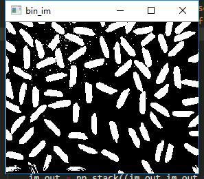
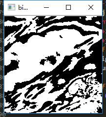
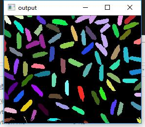
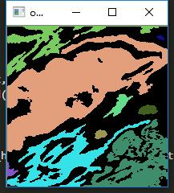

# 种子生长算法代码

### 算法步骤：

1.对图像顺序扫描，找到第一个还没有标记的像素，设该像素为`(x0,y0)`，若之前已有k类，则标记`(x0,y0)`为第k+1类，并把`(x0,y0)`压入堆栈`stack`

2.，从堆栈中取出一个像素当做`(x0,y0)`，以`(x0,y0)`为中心考虑`(x0,y0)`的8领域（或者4领域）的像素`(x,y)`，如果`(x,y)`与`(x0,y0)`像素值在一定范围内，把`(x,y)`也标记为第k+1类，并把`(x,y)`压入堆栈`stack`

3.重复执行步骤2直到堆栈为空，当堆栈为空时，返回到步骤1

4.重复执行步骤1-3直到图像中的每个点都被标记，生长结束。

### 使用方法：

1.img中是测试图片

2.growseed.py可以演示种子生长的具体流程

3.growseed_filter.py添加了面积的计算，其中面积小于`threshold`的会被过滤掉，最终输出一个随机颜色类别表示的标记图片

4.**本代码只适合灰度图像**

### 示例图片：

输入二值图像

输出面积过滤后的图像

用于车牌检测

### Enjoy Yourself!
=======